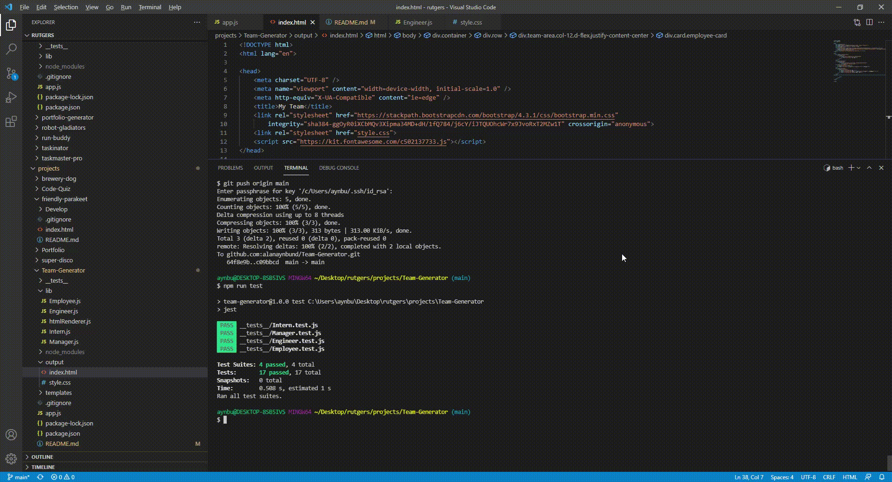

# Team-Generator

## Made With
  * HTML
  * JavaScript
  * CSS
  * Node
  * Jest

# Description
I made an application where you can generate an HTML file of a generated team for a workspace by prompting the user multiple questions about roles and positions.

# Walkthrough Video

Starter code provided by Kevin in Rutgers repo
